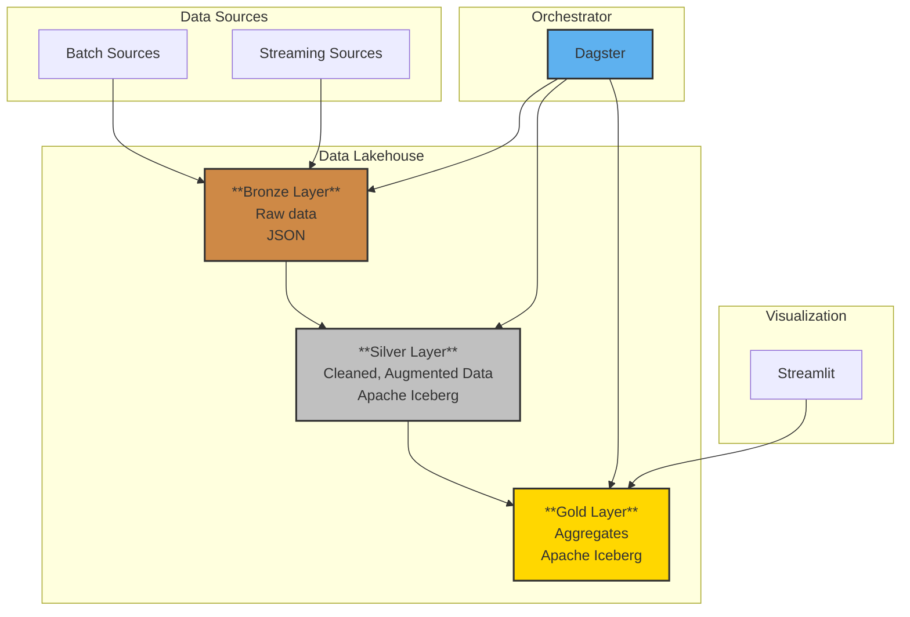

# Dagster-Iceberg project

This is a project to investigate how to set up a modern data toolstack with Dagster, Apache Iceberg, Azure and DuckDB or Daft.

```mermaid
graph TD
    subgraph Data Sources
        Batch[Batch Sources]
        Stream[Streaming Sources]
    end
    subgraph Orchestrator
        direction TB
        Dagster[Dagster]
    end
    subgraph Visualization
        direction TB
        Streamlit[Streamlit]
    end
    subgraph Data Lakehouse
        direction LR
        Bronze[**Bronze Layer**<br>Raw data <br> JSON]
        Silver[**Silver Layer**<br>Cleaned, Augmented Data<br>Apache Iceberg]
        Gold[**Gold Layer**<br>Aggregates<br>Apache Iceberg]
    end
    


    Batch --> Bronze
    Stream --> Bronze
    Bronze --> Silver
    Silver --> Gold
    Streamlit --> Gold
    Dagster --> Bronze
    Dagster --> Silver
    Dagster --> Gold
    style Bronze fill:#CE8946,stroke:#333,stroke-width:2px
    style Silver fill:#C0C0C0,stroke:#333,stroke-width:2px
    style Gold fill:#FFD700,stroke:#333,stroke-width:2px
    style Dagster fill:#5eb1ef,stroke:#333,stroke-width:2px

```