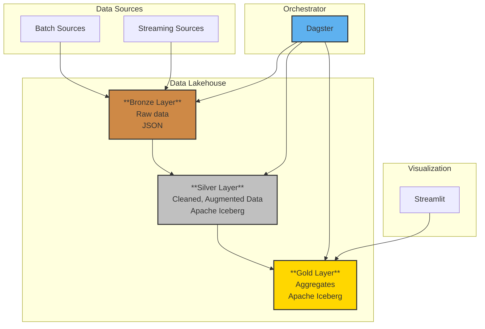

# Dagster-Iceberg project

This is a project to investigate how to set up a modern data toolstack with Dagster, Apache Iceberg, Azure and DuckDB or Daft.

## Get started

- Create a **.env** in fab-data/ like this:
```
AZURE_CONNECTION_STRING = "<connection string>"
AZURE_BRONZE_CONTAINER_NAME = "<bronze>"
AZURE_SILVER_CONTAINER_NAME = "<silver>"
AZURE_GOLD_CONTAINER_NAME = "<gold>"
AZURE_STORAGE_ACCOUNT_NAME = "<your account>"
AZURE_STORAGE_ACCOUNT_KEY = "<your key>"
```

- Install python modules.
TODO.

- Start dagster to run **setup_silver** and **setup_gold assets**.
These jobs create local sqlite Iceberg catalogs and the namespaces/tables in Azure.

- Run **fake_data.py** to create fake semiconductor manufacturing data.
These json files will get loaded automatically into an Azure container as raw data if the sensor is activated in Dagster.

- Running **write_silver_fabdata** and **write_gold_fabreport** loads the data into Iceberg tables and execute some basic aggregations for the gold layer.

- With "**streamlit run fab_report.py**" you can start a simple Streamlit report dashboard that uses the gold layer.

## Architecture



## Contributing
Pull requests are welcome. For major changes, please open an issue first to discuss what you would like to change.

Please make sure to update tests as appropriate.