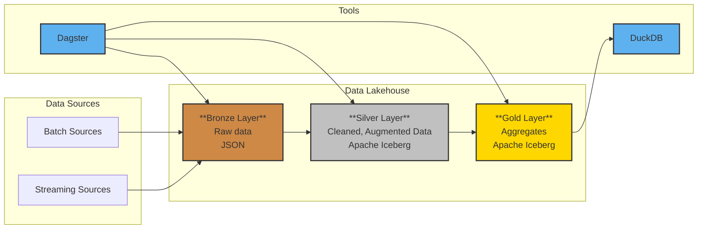

# Dagster-Iceberg project

This is a project to investigate how to set up a modern toolstack with Dagster, PyIceberg, Azure and DuckDB or Daft.

```mermaid
graph LR
    subgraph Data Sources
        A[Batch Sources]
        B[Streaming Sources]
    end
    
    subgraph Data Lakehouse
        direction LR
        C[**Bronze Layer**<br>Raw data <br> JSON]
        D[**Silver Layer**<br>Cleaned, Augmented Data<br>Apache Iceberg]
        E[**Gold Layer**<br>Aggregates<br>Apache Iceberg]
    end
    
    subgraph Tools
        direction TB
        F[Dagster]
        G[DuckDB]
    end

    A --> C
    B --> C
    C --> D
    D --> E
    E --> G
    F --> C
    F --> D
    F --> E
    
    style C fill:#CE8946,stroke:#333,stroke-width:2px
    style D fill:#C0C0C0,stroke:#333,stroke-width:2px
    style E fill:#FFD700,stroke:#333,stroke-width:2px
    style F fill:#5eb1ef,stroke:#333,stroke-width:2px
    style G fill:#5eb1ef,stroke:#333,stroke-width:2px
```